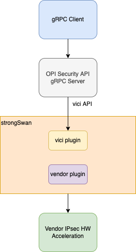
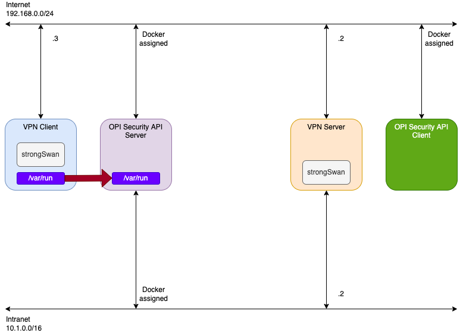

# OPI to strongSwan bridge using vici API

[](https://github.com/opiproject/opi-strongswan-bridge/actions/workflows/linters.yml)
[](https://github.com/opiproject/opi-strongswan-bridge/actions/workflows/codeql.yml)
[](https://securityscorecards.dev/viewer/?platform=github.com&org=opiproject&repo=opi-strongswan-bridge)
[](https://github.com/opiproject/opi-strongswan-bridge/actions/workflows/go.yml)
[](https://github.com/opiproject/opi-strongswan-bridge/actions/workflows/docker-publish.yml)
[](https://github.com/opiproject/opi-strongswan-bridge/blob/master/LICENSE)
[](https://codecov.io/gh/opiproject/opi-strongswan-bridge)
[](https://goreportcard.com/report/github.com/opiproject/opi-strongswan-bridge)
[](http://godoc.org/github.com/opiproject/opi-strongswan-bridge)
[](https://hub.docker.com/r/opiproject/opi-strongswan-bridge)
[](https://github.com/opiproject/opi-strongswan-bridge/releases)
[](https://github.com/opiproject/opi-strongswan-bridge)
[](https://github.com/opiproject/opi-strongswan-bridge/graphs/contributors)

This directory contains the security PoC for OPI. This includes reference code
for the [IPsec](https://github.com/opiproject/opi-api/blob/main/security/v1/ipsec.proto)
APIs. The specification for these APIs can be found
[here](https://github.com/opiproject/opi-api/blob/main/security/v1/autogen.md).

## I Want To Contribute

This project welcomes contributions and suggestions.  We are happy to have the Community involved via submission of **Issues and Pull Requests** (with substantive content or even just fixes). We are hoping for the documents, test framework, etc. to become a community process with active engagement.  PRs can be reviewed by by any number of people, and a maintainer may accept.

See [CONTRIBUTING](https://github.com/opiproject/opi/blob/main/CONTRIBUTING.md) and [GitHub Basic Process](https://github.com/opiproject/opi/blob/main/doc-github-rules.md) for more details.

## Architecture Diagram

The following is the example architecture we envision for the OPI Security
APIs. For IPsec, it utilizes strongSwan to handle IPsec IKE sessions and ESP
keys, and assumes a vendor plugin in strongSwan for offloading ESP tunnels into
HW acceleration.



Note that the architecture is meant to show how the OPI Security APIs can work
in tandem with the [OPI sessionOffload APIs](https://github.com/opiproject/sessionOffload)
to provide a full IPsec experience, from IKE session creation to ESP session
offload.

## PoC Diagram



## Getting started

:exclamation: `docker-compose` is deprecated. For details, see [Migrate to Compose V2](https://docs.docker.com/compose/migrate/).

Run `docker-compose up -d`

## Security gRPC example

Optionally if you need to download modules

```bash
docker run --rm -it -v `pwd`:/app -w /app golang:alpine go get all
docker run --rm -it -v `pwd`:/app -w /app golang:alpine go get github.com/opiproject/opi-api/security/proto
docker run --rm -it -v `pwd`:/app -w /app golang:alpine go mod tidy
```

Run example client via compose (not for production)

```bash
$ docker-compose up opi-security-client
[+] Running 4/0
 ⠿ Container opi-strongswan-bridge-vpn-server-1           Running                                                                                                                       0.0s
 ⠿ Container opi-strongswan-bridge-vpn-client-1           Running                                                                                                                       0.0s
 ⠿ Container opi-strongswan-bridge-opi-security-server-1  Running                                                                                                                       0.0s
 ⠿ Container opi-strongswan-bridge-opi-security-client-1  Created                                                                                                                       0.0s
Attaching to opi-strongswan-bridge-opi-security-client-1
opi-strongswan-bridge-opi-security-client-1  | 2023/02/09 02:05:06 Daemon  [charon]
opi-strongswan-bridge-opi-security-client-1  | 2023/02/09 02:05:06 Version [5.9.9]
opi-strongswan-bridge-opi-security-client-1  | 2023/02/09 02:05:06 Sysname [Linux]
opi-strongswan-bridge-opi-security-client-1  | 2023/02/09 02:05:06 Release [4.18.0-373.el8.x86_64]
opi-strongswan-bridge-opi-security-client-1  | 2023/02/09 02:05:06 Machine [x86_64]
opi-strongswan-bridge-opi-security-client-1  | 2023/02/09 02:05:06 IPsec stats
opi-strongswan-bridge-opi-security-client-1  | Running time: 97 seconds
opi-strongswan-bridge-opi-security-client-1  | Absolute startup time: Feb 09 02:03:29 2023
opi-strongswan-bridge-opi-security-client-1  | Total # of worker threads: 16
opi-strongswan-bridge-opi-security-client-1  | Worker threads currently idle: 11
opi-strongswan-bridge-opi-security-client-1  | Threads processing critical priority jobs: 4
opi-strongswan-bridge-opi-security-client-1  | Threads processing high priority jobs: 0
opi-strongswan-bridge-opi-security-client-1  | Threads processing medium priority jobs: 1
opi-strongswan-bridge-opi-security-client-1  | Threads processing low priority jobs: 0
opi-strongswan-bridge-opi-security-client-1  | Jobs queued with critical priority: 0
opi-strongswan-bridge-opi-security-client-1  | Jobs queued with high priority: 0
opi-strongswan-bridge-opi-security-client-1  | Jobs queued with medium priority: 0
opi-strongswan-bridge-opi-security-client-1  | Jobs queued with low priority: 0
opi-strongswan-bridge-opi-security-client-1  | # of jobs scheduled for timed execution: 4
opi-strongswan-bridge-opi-security-client-1  | Total number of IKE_SAs active: 0
opi-strongswan-bridge-opi-security-client-1  | Number of IKE_SAs in half-open state: 0
opi-strongswan-bridge-opi-security-client-1  | Plugins: charon random nonce x509 constraints pubkey pem openssl kernel-netlink resolve socket-default vici updown eap-identity eap-md5 eap-dynamic eap-tls
opi-strongswan-bridge-opi-security-client-1  | Non-mmap'd space available: 3268608
opi-strongswan-bridge-opi-security-client-1  | Mmap'd space available: 0
opi-strongswan-bridge-opi-security-client-1  | Total number of bytes used: 1479904
opi-strongswan-bridge-opi-security-client-1  | Available but unsued bytes: 1788704
opi-strongswan-bridge-opi-security-client-1  | 2023/02/09 02:05:06 Loaded: success:"Yes"
opi-strongswan-bridge-opi-security-client-1  | 2023/02/09 02:05:06 Initiated:
opi-strongswan-bridge-opi-security-client-1  | 2023/02/09 02:05:06 Returned ikeSas: ikesas:{name:"opi-test"  uniqueid:"3"  version:"2"  ikestate:ESTABLISHED  local_host:"192.168.200.200"  local_port:"4500"  local_id:"hacker@strongswan.org"  remote_host:"192.168.200.210"  remote_port:"4500"  remote_id:"server.strongswan.org"  initiator:"yes"  initiator_spi:"2a6b4e46c1199545"  responder_spi:"4a9da540276d6147"  encr_alg:"AES_CBC"  encr_keysize:"256"  integ_alg:"HMAC_SHA2_256_128"  prf_alg:"PRF_HMAC_SHA2_256"  dh_group:"CURVE_25519"  established:"0"  rekey_time:"13499"  local_vips:"10.3.0.1"  childsas:{name:"opi-child-2"  protocol:"ESP"  spi_in:"c043deae"  spi_out:"c35fdf8e"  mark_in:"00000000"  mark_out:"00000000"  encr_alg:"AES_GCM_16"  encr_keysize:"256"}}
opi-strongswan-bridge-opi-security-client-1  | 2023/02/09 02:05:06 Returned connections: connection:{name:"opi-test"  local_addrs:{addr:"192.168.200.200"}  remote_addrs:{addr:"192.168.200.210"}  version:"IKEv2"  rekey_time:14400  unique:"UNIQUE_NO"  children:{name:"opi-child"  mode:"TUNNEL"  rekey_time:3600  dpd_action:"none"  close_action:"none"  local_ts:{ts:{cidr:"dynamic"}}  remote_ts:{ts:{cidr:"10.1.0.0/16"}}}}
opi-strongswan-bridge-opi-security-client-1  | 2023/02/09 02:05:06 Returned certificates: certs:{hasprivkey:"yes"  data:"MIIB/zCCAYWgAwIBAgIICmApmnHxbpUwCgYIKoZIzj0EAwMwNTELMAkGA1UEBhMCQ0gxDjAMBgNVBAoTBUN5YmVyMRYwFAYDVQQDEw1DeWJlciBSb290IENBMB4XDTIwMDMwOTEzNTkwNloXDTI0MDMwOTEzNTkwNlowPTELMAkGA1UEBhMCQ0gxDjAMBgNVBAoTBUN5YmVyMR4wHAYDVQQDExVjbGllbnQuc3Ryb25nc3dhbi5vcmcwdjAQBgcqhkjOPQIBBgUrgQQAIgNiAATtv3hJtqlsOU1CciT03FFi0S+BMWhDCoveOLlLBY2xE/Cic+s//fLn7g3UzEG2DPdB++7emFOMlnKBRnhg3sbxejiRFdnjwILZxWo/htyKoB1zbU2ALmjdZV+rQLGZPeejWjBYMB8GA1UdIwQYMBaAFLjSYIqHz0jucV3YUSAjWsGq5feyMCAGA1UdEQQZMBeCFWNsaWVudC5zdHJvbmdzd2FuLm9yZzATBgNVHSUEDDAKBggrBgEFBQcDAjAKBggqhkjOPQQDAwNoADBlAjACrgXJrY3RoERgbfD++vvY8If1P9acT4JDbcTsLNDCgrqooCpU6nawP7Vp5eEbkyoCMQCr+VshJEge7smR6jkZVAqo4N5Zm/GWqCgfJVsmtlie1o4m+cwhpiM2axUIA0osTP8="}  certs:{flag:X509_CERT_FLAG_CA  data:"MIIB3zCCAWWgAwIBAgIIWWpjqeLZ9K8wCgYIKoZIzj0EAwMwNTELMAkGA1UEBhMCQ0gxDjAMBgNVBAoTBUN5YmVyMRYwFAYDVQQDEw1DeWJlciBSb290IENBMB4XDTIwMDMwOTEyMDIwOVoXDTMwMDMwOTEyMDIwOVowNTELMAkGA1UEBhMCQ0gxDjAMBgNVBAoTBUN5YmVyMRYwFAYDVQQDEw1DeWJlciBSb290IENBMHYwEAYHKoZIzj0CAQYFK4EEACIDYgAEaRTgNHa/qa3D/mjvHr/Cr4f20KHiGzlarAXnnDkDUnT7/YEoWBAohYqJFOOeuUc1dsIhXQFN/VVLP+Gyf0pSu272Nx7jA3IwERV12W7cV23YNUJVpNWpY2t61UWiHeh4o0IwQDAPBgNVHRMBAf8EBTADAQH/MA4GA1UdDwEB/wQEAwIBBjAdBgNVHQ4EFgQUuNJgiofPSO5xXdhRICNawarl97IwCgYIKoZIzj0EAwMDaAAwZQIwPR1T8MHS+aV9qSueIE9QfPRgEVyvuaz2g4q7DN51SUfypjYoAX+B6BqiR7vfgY2YAjEA65R8XZy0N6LEYgAEPPbQSyCdJudoa4MwidaomSwwgiVDePN356onk/lhURmEQBaZ"}  certs:{}
opi-strongswan-bridge-opi-security-client-1  | 2023/02/09 02:05:10 Ping stats: &{5 5 0 0 10.3.0.1 10.3.0.1 [195.182µs 243.816µs 274.872µs 287.973µs 286.97µs] 195.182µs 287.973µs 257.762µs 35.126µs}
opi-strongswan-bridge-opi-security-client-1  | 2023/02/09 02:05:10 Rekeyed IKE_SA opi-test: success:"yes"  matches:1
opi-strongswan-bridge-opi-security-client-1  | 2023/02/09 02:05:10 Terminate: success:"Yes"  matches:1
opi-strongswan-bridge-opi-security-client-1  | 2023/02/09 02:05:10 Unloaded: success:"Yes"
opi-strongswan-bridge-opi-security-client-1  | 2023/02/09 02:05:10 GRPC connection closed successfully
opi-strongswan-bridge-opi-security-client-1  | <nil>
opi-strongswan-bridge-opi-security-client-1 exited with code 0
```

## gRPC CLI

From <https://github.com/grpc/grpc-go/blob/master/Documentation/server-reflection-tutorial.md>

Alias

```bash
alias grpc_cli='docker run --network=opi-strongswan-bridge_internet --rm -it namely/grpc-cli'
```

See services

```bash
 $ grpc_cli ls opi-security-server:50051
grpc.reflection.v1alpha.ServerReflection
opi_api.security.v1.IPsec
```

See commands

```bash
$ grpc_cli ls opi-security-server:50051 opi_api.security.v1.IPsec -l
filename: ipsec.proto
package: opi_api.security.v1;
service IPsec {
  rpc IPsecVersion(opi_api.security.v1.IPsecVersionReq) returns (opi_api.security.v1.IPsecVersionResp) {}
  rpc IPsecStats(opi_api.security.v1.IPsecStatsReq) returns (opi_api.security.v1.IPsecStatsResp) {}
  rpc IPsecInitiate(opi_api.security.v1.IPsecInitiateReq) returns (opi_api.security.v1.IPsecInitiateResp) {}
  rpc IPsecTerminate(opi_api.security.v1.IPsecTerminateReq) returns (opi_api.security.v1.IPsecTerminateResp) {}
  rpc IPsecRekey(opi_api.security.v1.IPsecRekeyReq) returns (opi_api.security.v1.IPsecRekeyResp) {}
  rpc IPsecListSas(opi_api.security.v1.IPsecListSasReq) returns (opi_api.security.v1.IPsecListSasResp) {}
  rpc IPsecListConns(opi_api.security.v1.IPsecListConnsReq) returns (opi_api.security.v1.IPsecListConnsResp) {}
  rpc IPsecListCerts(opi_api.security.v1.IPsecListCertsReq) returns (opi_api.security.v1.IPsecListCertsResp) {}
  rpc IPsecLoadConn(opi_api.security.v1.IPsecLoadConnReq) returns (opi_api.security.v1.IPsecLoadConnResp) {}
  rpc IPsecUnloadConn(opi_api.security.v1.IPsecUnloadConnReq) returns (opi_api.security.v1.IPsecUnloadConnResp) {}
}
```

See methods

```bash
$ grpc_cli ls opi-security-server:50151 opi_api.security.v1.IPsec.IPsecLoadConn -l
  rpc IPsecLoadConn(opi_api.security.v1.IPsecLoadConnReq) returns (opi_api.security.v1.IPsecLoadConnResp) {}
```

See messages

```bash
$ grpc_cli type opi-security-server:50051 opi_api.security.v1.IPsecCreateRequest
message IPsecCreateRequest {
  .opi_api.security.v1.TunnelInterfaces tunnel = 1 [json_name = "tunnel"];
  .opi_api.security.v1.SecurityPolicyDatabases policy = 2 [json_name = "policy"];
  .opi_api.security.v1.SecurityAssociations sa = 3 [json_name = "sa"];
}
```

Call remote method

```bash
$ grpc_cli call opi-security-server:50051 IPsecDelete  "id: {value: 'bla'}"
connecting to opi-security-server:50051
id {
  value: "bla"
}
Rpc succeeded with OK status
```

Server log

```bash
opi-security-server_1  | 2022/08/05 17:19:18 IPsecDelete: Received: value:"bla"
```

## Architecture

The architecture of the PoC includes the following components:

* strongSwan server container
* strongSwan client container
* OPI Security API server container
* OPI Security API client container


### Create

On creation of a new IPsec tunnel, the OPI API Security server will do the
following:

* Receive the API call on the northbound side
* Using the vici API
  * Program the new IKE session into strongSwan
  * Trigger the connection
  * Offload the ESP session using the sessionOffload API

### Delete

On deletion of an IPsec tunnel, the OPI API Security server will do the
following:

* Receive the API call on the northbound side
* Using the vici API:
  * Down the connection
  * Delete the IKE session from strongSwan
