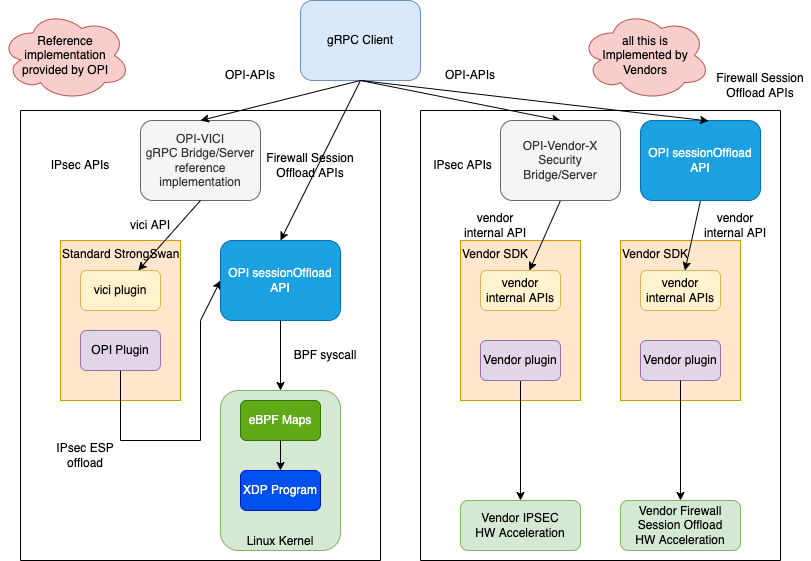
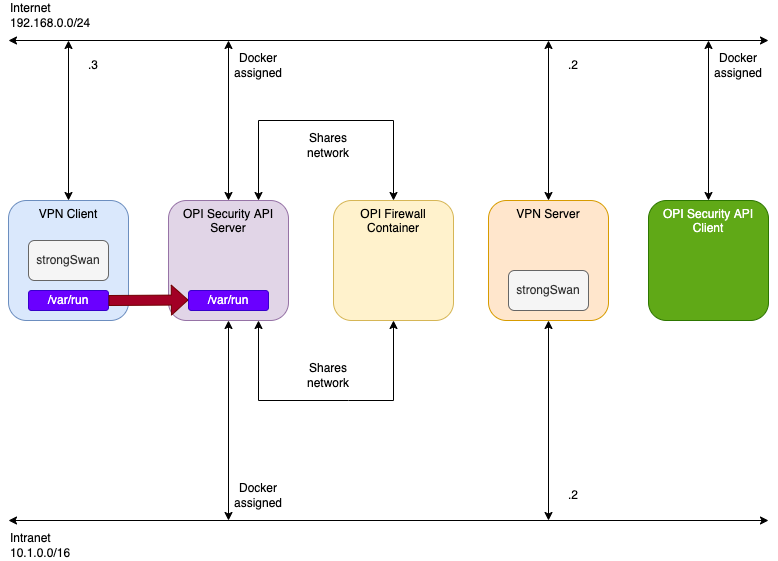

# Security PoC

This directory contains the security PoC for OPI. This includes reference code
for the [IPsec](https://github.com/opiproject/opi-api/blob/main/security/proto/ipsec.proto)
APIs. The specification for these APIs can be found
[here](https://github.com/opiproject/opi-api/blob/main/security/v1/autogen.md).

## Architecture Diagram

The following is the example architecture we envision for the OPI Security
APIs. For IPsec, it utilizes strongSwan to handle IPsec IKE sessions and ESP
keys, and assumes a vendor plugin in strongSwan for offloading ESP tunnels into
HW acceleration.



## PoC Diagram



## Getting started

Run `docker-compose up -d`

## Security gRPC example

Optionally if you need to download modules

```bash
docker run --rm -it -v `pwd`:/app -w /app golang:alpine go get all
docker run --rm -it -v `pwd`:/app -w /app golang:alpine go get github.com/opiproject/opi-api/security/proto
docker run --rm -it -v `pwd`:/app -w /app golang:alpine go mod tidy
```

Run example client via compose (not for production)

```bash
$ docker-compose up opi-security-client
security_vpn-client_1 is up-to-date
security_strongswan_1 is up-to-date
security_opi-security-server_1 is up-to-date
Starting security_opi-security-client_1 ... done
Attaching to security_opi-security-client_1
opi-security-client_1  | 2022/08/05 17:11:47 Added: id:{value:"75c6e1bc-efed-4044-9888-d3b3503eb786"}
opi-security-client_1  | 2022/08/05 17:11:47 Get: id:{value:"75c6e1bc-efed-4044-9888-d3b3503eb786"}
opi-security-client_1  | 2022/08/05 17:11:47 Updated: id:{value:"75c6e1bc-efed-4044-9888-d3b3503eb786"}
opi-security-client_1  | 2022/08/05 17:11:47 Get: id:{value:"75c6e1bc-efed-4044-9888-d3b3503eb786"}
opi-security-client_1  | 2022/08/05 17:11:47 Deleted: id:{value:"75c6e1bc-efed-4044-9888-d3b3503eb786"}
security_opi-security-client_1 exited with code 0
```

## gRPC CLI

From <https://github.com/grpc/grpc-go/blob/master/Documentation/server-reflection-tutorial.md>

Alias

```bash
alias grpc_cli='docker run --network=security_internet --rm -it namely/grpc-cli'
```

See services

```bash
 $ grpc_cli ls opi-security-server:50051
grpc.reflection.v1alpha.ServerReflection
opi_api.security.v1.IPsec
```

See commands

```bash
$ grpc_cli ls opi-security-server:50051 opi_api.security.v1.IPsec -l
filename: ipsec.proto
package: opi_api.security.v1;
service IPsec {
  rpc IPsecCreate(opi_api.security.v1.IPsecCreateRequest) returns (opi_api.security.v1.IPsecCreateResponse) {}
  rpc IPsecDelete(opi_api.security.v1.IPsecDeleteRequest) returns (opi_api.security.v1.IPsecDeleteResponse) {}
  rpc IPsecUpdate(opi_api.security.v1.IPsecUpdateRequest) returns (opi_api.security.v1.IPsecUpdateResponse) {}
  rpc IPsecList(opi_api.security.v1.IPsecListRequest) returns (opi_api.security.v1.IPsecListResponse) {}
  rpc IPsecGet(opi_api.security.v1.IPsecGetRequest) returns (opi_api.security.v1.IPsecGetResponse) {}
}
```

See methods

```bash
$ grpc_cli ls opi-security-server:50051 opi_api.security.v1.IPsec.IPsecCreate -l
  rpc IPsecCreate(opi_api.security.v1.IPsecCreateRequest) returns (opi_api.security.v1.IPsecCreateResponse) {}
```

See messages

```bash
$ grpc_cli type opi-security-server:50051 opi_api.security.v1.IPsecCreateRequest
message IPsecCreateRequest {
  .opi_api.security.v1.TunnelInterfaces tunnel = 1 [json_name = "tunnel"];
  .opi_api.security.v1.SecurityPolicyDatabases policy = 2 [json_name = "policy"];
  .opi_api.security.v1.SecurityAssociations sa = 3 [json_name = "sa"];
}
```

Call remote method

```bash
$ grpc_cli call opi-security-server:50051 IPsecDelete  "id: {value: 'bla'}"
connecting to opi-security-server:50051
id {
  value: "bla"
}
Rpc succeeded with OK status
```

Server log

```bash
opi-security-server_1  | 2022/08/05 17:19:18 IPsecDelete: Received: value:"bla"
```

## Architecture

The architecture of the PoC includes the following components:

* strongSwan server container
* strongSwan client container
* OPI Security API server container
* OPI Security API client container


### Create

On creation of a new IPsec tunnel, the OPI API Security server will do the
following:

* Receive the API call on the northbound side
* Write a strongSwan configuration file to disk
* Using the vici API
  * Reload strongSwan configuration
  * Trigger the connection

### Delete

On deletion of an IPsec tunnel, the OPI API Security server will do the
following:

* Receive the API call on the northbound side
* Delete the local configuration file on disk
* Using the vici API:
  * Down the connection
  * Reload strongSwan configuration
